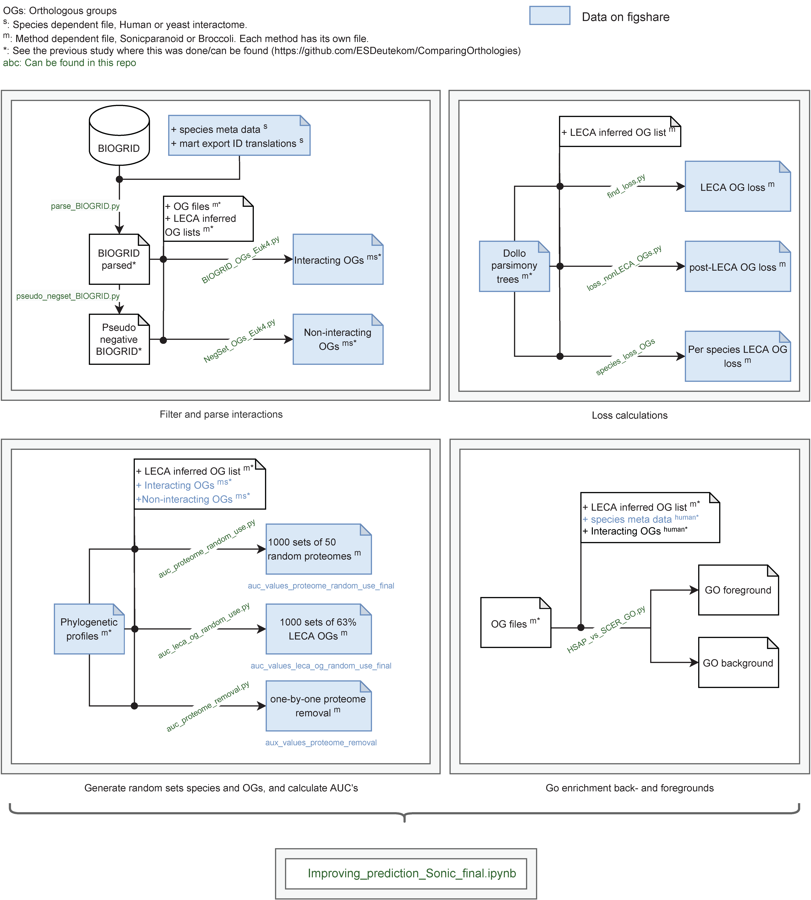

# SelectionPhylogeneticProfiling

Manuscript: "Phylogenetic profiling in eukaryotes: The effect of species, orthologous group, and interactome selection on protein interaction prediction"
Authors: E.S. Deutekom, T.J.P. van Dam, B. Snel

## Disclaimer
This serves to share code and data for reproducibility.
Due to the amount of data, we cannot share all the data. Most data is readily available. Any additional (pre-made) data can be shared upon request.

## Contained directories and files
Main analysis notebook: Improving_prediction_Sonic_final.ipynb

### Code
Code at least needed for reproducibility, used outside of the jupyter notebook for the analyses.
Previous work was done using code from: https://github.com/ESDeutekom/ComparingOrthologies/tree/master/eukarya/scripts_nonsql

#### Software and tools in analyses
- python		3.7.6

##### Python packages
- ete3			    3.1.1
- matplotlib 		3.1.2
- numpy			    1.18.1
- pandas		    1.0.1
- scipy			    1.4.1
- seaborn       0.11.1   
- scikit-learn  0.22.2. 

### Data

All data can be reproduced using the code provided here and previous work done in https://github.com/ESDeutekom/ComparingOrthologies/
Any additional data can be sent upon request.

#### Files in this analysis that can be downloaded
- BIOGRID Homo sapiens: 3.5.172.tab2.txt (https://thebiogrid.org)
- BIOGRID Saccharomyces cerevisiae S288c: 3.5.175.tab2.txt (https://thebiogrid.org)
- All pre-made files that are needed to reproduce the results in the jupyter notebook are shared with figshare (link)
- Orthogroup and leca orthogroup files: https://github.com/ESDeutekom/ComparingOrthologies/tree/master/eukarya/annotations
  - The phylogenetic profiles can also be made using the files and code in this previous repo
